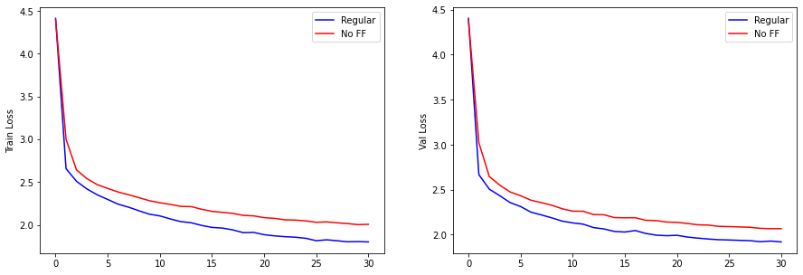
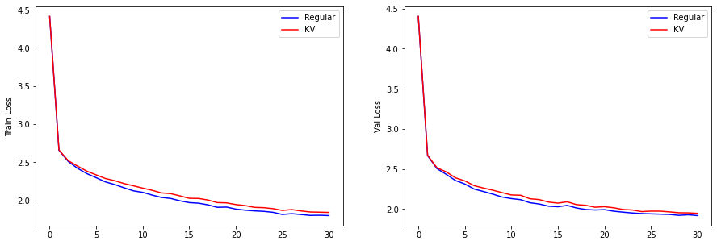
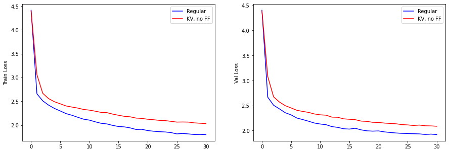

# nanogpt-lecture

Code created in the [Neural Networks: Zero To Hero](https://karpathy.ai/zero-to-hero.html) video lecture series, specifically on the first lecture on nanoGPT. Publishing here as a Github repo so people can easily hack it, walk through the `git log` history of it, etc.

# What will happen to a regular transformer-decoder if remove some parameters:

- If we remove the FF which is an Linear layer with LayerNorm, we reduce the number of parameters to __76865__ then losses will be:

- In regular transformation we use three elemnts of Q,K,V to get results from transformer, but what will happen if we use two of them? If we apply two elements to calculate the attention score, we will have below graph and the number of parameters will be __193345__.

$$attention = softmax(\frac{KV^T}{\sqrt {d}})V$$

- If we remove both above mentiond parameters, we have:

As can be seen from the graphs, the FF layer has more impact than the parametrs on regulater attention mechanism. That may due to number of parameters included in FF layer.
### License

MIT
